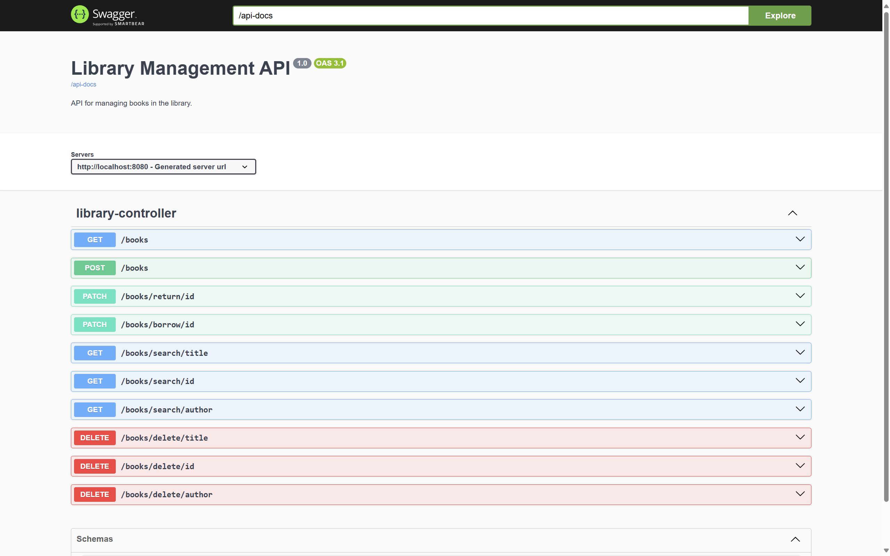

# Library Management System
RESTFul API with which users can add/remove, search by id, title, author, and borrow/return books. 

### Technology stack
Java + Spring Boot + Maven + H2 database

### Installation 

- Ensure Git is installed.
- Clone the repo using ```git clone https://github.com/novojitsaha/library_mgmt_system.git``` in your preferred directory.
- Ensure Java is installed and JAVA_HOME variable is added in your operating system's environment variables. 
- Ensure the Java version in the ```pom.xml``` file matches the Java version in your JAVA_HOME.
- Open terminal in your project root directory and enter ```./mvnw clean package javadoc:javadoc```. Wait for the build to be finished.
- Change directory to ```target``` folder with ```cd target```.
- Run the application with ```java -jar library-0.0.1-SNAPSHOT.jar```.

### Swagger API Endpoints Documentaion 


To view Swagger UI for API Documentation, visit ```localhost:8080/swagger.html``` (unless you are hosting on a different port).

### Javadocs


To view the Javadocs, open the ```index.html``` file located at ```./target/reports/apidocs``` in your favourite browser. 

### Database
The application will save the data in your home folder in a file called ```library_db```. This ensures that data persists between application restarts. If you'd like to change the location where data is saved, please change the value of ```spring.datasource.url``` in the ```application.properties``` file located at ```src/main/resources/application.properties```.

