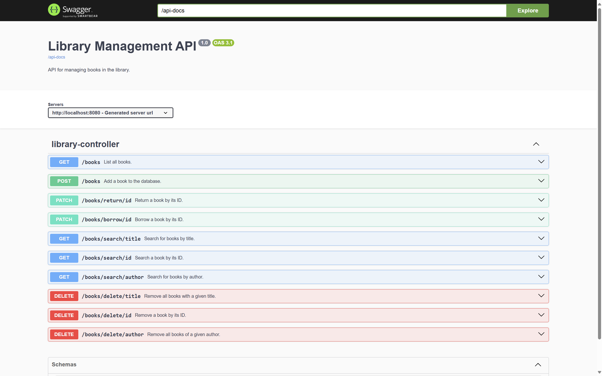

# Library Management System
RESTFul API with which users can add/remove, search by id, title, author, and borrow/return books. 

### Technology stack
Java + Spring Boot + Maven + H2 database

### Installation 

- Ensure Git is installed.
- Clone the repo using ```git clone https://github.com/novojitsaha/library_mgmt_system.git``` in your preferred directory.
- Ensure Java is installed and JAVA_HOME variable is added in your operating system's environment variables. 
- Ensure the Java version in the ```pom.xml``` file matches the Java version in your JAVA_HOME.
- Open terminal in your project root directory and enter ```./mvnw clean package javadoc:javadoc```. Wait for the build to be finished.
- Change directory to ```target``` folder with ```cd target```.
- Run the application with ```java -jar library-0.0.1-SNAPSHOT.jar```.

### Swagger API Endpoints Documentaion 


To view Swagger UI for API Documentation, visit ```localhost:8080/swagger.html``` (unless you are hosting on a different port).

### Javadocs

Javadocs for this project is live at [https://novojitsaha.github.io/library_mgmt_system](https://novojitsaha.github.io/library_mgmt_system).
You can also view the javadocs locally by opening ```./docs/apidocs/index.html``` in your favourite browser. 

### Database
The application will save the data in your home folder in a file called ```library_db```. This ensures that data persists between application restarts. If you'd like to change the location where data is saved, please change the value of ```spring.datasource.url``` located in ```src/main/resources/application.properties```.
This project requires simple database queries and therefore H2 database was deemed appropriate for its use case. Since it’s an embedded database, no external database server needs to be set up. 

### Design Patterns
A controller-service-repository pattern is used to keep the codebase clean and maintainable. All the API endpoints are defined in the ```LibraryController``` Class, while ```LibraryService``` Class handles the business logic and ```BookRepository``` Class integrates the H2 database.


